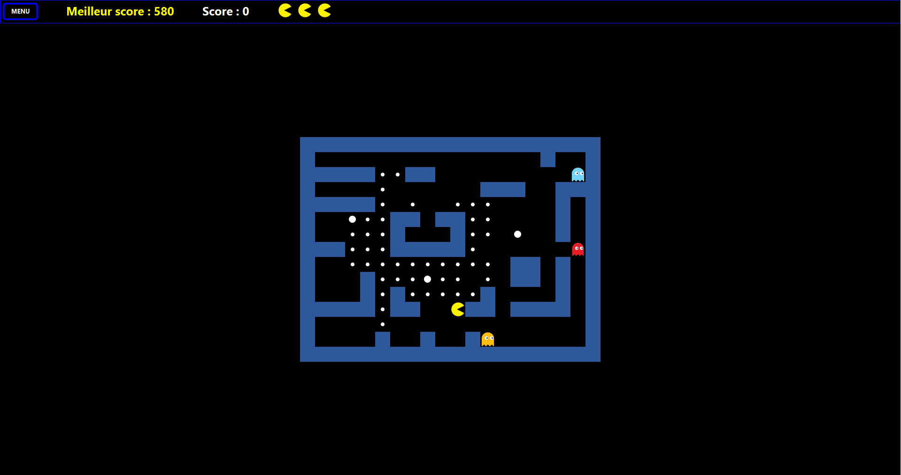

<p align="center">
    

  <h1 align="center"> Pac-Man </h1>

  <p align="center">
    <br />
    <a href="#about-the-project">About the project</a>
    ·
    <a href="#built-with">Built With</a>
    ·
    <a href="#main-features">Main Features</a>
    ·
    <a href="#getting-started">Getting Started</a>
    .
    <a href="#contact">Contact</a>
    <br>
    <br>
    <a href="https://www.linkedin.com/in/victor-combat/" target="_blank"></a>
  <a href="https://github.com/VictorCombat/VictorCombat" target="_blank"></a>
  <a href="mailto:victor.cmbt@gmail.com" target="_blank"></a>
  </p>
</p>

<br>

<!-- ABOUT THE PROJECT -->
## About the project

As part of my university training, in the 3rd year of a Computer Science license, this 3-week project aimed to learn to develop/recreate the famous game Pac-Man using the Java programming language, the JavaFX graphic library, with object-oriented programming and MVC architecture.

<!-- BUILT WITH -->
## Built With

* Java
* JavaFX

<!-- MAIN FEATURES -->
## Main Features

* Moving Pac-Man through the grid
* Ghost foes
* Scoring by eating white dots
* Score records
* Level editor

<!-- GETTING STARTED -->
## Getting Started

1. Clone the repo
    ```sh
    git clone https://github.com/VictorCombat/pac-man.git
    ```
2. Launch the PacMan.jar file
3. Enjoy :video_game: :smiley:

<!-- CONTACT -->
## Contact

<p align="center">
  <a href="https://www.linkedin.com/in/victor-combat/" target="_blank"></a>
  <a href="https://github.com/VictorCombat/VictorCombat" target="_blank"></a>
  <a href="mailto:victor.cmbt@gmail.com" target="_blank"></a>
</p>

##
<p align="center">
  <a href="#"></a>
</p>
